# System Architecture & Technical Flow

This document details the architecture, node connections, decision flows, and data transformations implemented in the **WooCommerce AI Store Automation** n8n workflow.

---

## 1. High-Level System Architecture

```text
                                  +-----------------------+
                                  |   Telegram Bot User   |
                                  +-----------+-----------+
                                              |
                                      (Commands / Photos)
                                              v
+--------------------+            +-----------+-----------+
| WooCommerce Store  |<---------->|     n8n AI Engine     |
| (Products & Orders)|            | (LangChain + OpenAI)  |
+---------+----------+            +-----------+-----------+
          |                                   |
    (order.created)                    (Order Alerts,
          v                            Invoice PDFs & Sheets)
+---------+-----------------------------------+-----------+
|                                                         |
|  +----------------+   +---------------+   +-----------+ |
+->| Google Drive   |   | Google Sheets |   |   Gmail   | |
   | (PDF Archival) |   | (Order & CRM) |   | (Invoices)| |
   +----------------+   +---------------+   +-----------+ |
+---------------------------------------------------------+
```

---

## 2. Subsystem Breakdown & Detailed Workflows

The workflow comprises 53 nodes divided across four core functional pipelines:

```mermaid
graph TD
    subgraph Subsystem 1: Telegram AI Agent & Image Pipeline
        TG_TRIG[Telegram Trigger] --> SW[Switch: Text vs Image]
        SW -- Text Message --> AG1[AI Agent: WooBot]
        SW -- Image Upload --> HTTP_WP[HTTP Request: WP Media Upload]
        HTTP_WP --> JS_URL[Code: Format Public Image URL]
        JS_URL --> AG1
        
        AG1 --> IF_IMG{Contains ##IMAGE_UPDATE##?}
        IF_IMG -- No --> TG_RESP[Send Text Message to User]
        IF_IMG -- Yes --> AG_IMG[AI Agent: Product Image Update]
        AG_IMG --> TG_RESP2[Send Confirmation to User]
    end

    subgraph Subsystem 2: Order Processing & Invoicing
        WC_TRIG[WooCommerce Trigger: order.created] --> FMT[Set: Format Data]
        FMT --> INV_CODE[Code: HTML Invoice Template]
        INV_CODE --> PDF_CONV[HTML/CSS to PDF]
        PDF_CONV --> HTTP_PDF[HTTP Request: Download PDF]
        HTTP_PDF --> GDRIVE_UP[Google Drive: Upload PDF]
        GDRIVE_UP --> GDRIVE_DL[Google Drive: Download for Attachment]
        GDRIVE_DL --> GMAIL[Gmail: Send Invoice to Customer]
        GMAIL --> TG_ADMIN[Telegram: Admin Order Alert]
        TG_ADMIN --> GS_CUST[Google Sheets: Upsert Customer Data]
        GS_CUST --> GS_ORD[Google Sheets: Append Order Record]
    end

    subgraph Subsystem 3: Sales Reporting Branches
        MAN_TRIG[Manual Trigger] --> WC_ORD0[WooCommerce: Get Orders]
        WC_ORD0 --> JS_REP0[Code: Aggregate Metrics]
        JS_REP0 --> AG_REP0[AI Agent: Daily Sales Analyst]
        AG_REP0 --> TG_REP0[Telegram: Send Daily Report]

        SCH_M[Schedule: Monthly Trigger] --> WC_ORD1[WooCommerce: Get Orders]
        WC_ORD1 --> JS_REP1[Code: Aggregate Metrics]
        JS_REP1 --> AG_REP1[AI Agent: Sales Analyst]
        AG_REP1 --> TG_REP1[Telegram: Send Report]

        SCH_W1[Schedule: Weekly Trigger] --> WC_ORD2[WooCommerce: Get Orders]
        WC_ORD2 --> JS_REP2[Code: Aggregate Metrics]
        JS_REP2 --> AG_REP2[AI Agent: Sales Analyst]
        AG_REP2 --> TG_REP2[Telegram: Send Report]

        SCH_W2[Schedule: Weekly Trigger 2] --> WC_ORD3[WooCommerce: Get Orders]
        WC_ORD3 --> JS_REP3[Code: Aggregate Metrics]
        JS_REP3 --> AG_REP3[AI Agent: Sales Analyst]
        AG_REP3 --> TG_REP3[Telegram: Send Report]
    end
```



---

## 3. Component Deep Dive

### Subsystem 1: Telegram Store Management Agent & Image Handler

```text
Telegram Message
      |
      v
[ Switch Node ]
 ├── Output 0 (Text Only) ───────> [ AI Agent: WooBot ]
 └── Output 1 (Image Upload) ────> [ WordPress REST API: POST /wp-json/wp/v2/media ]
                                            │
                                            v
                                   [ Code: Extract Image URL ]
                                            │
                                            v
                                   [ AI Agent: WooBot ]
                                            │
                                            v
                                   [ IF: Is Image Update Intent? ]
                                    ├── FALSE: Send Agent Reply to User
                                    └── TRUE:  [ AI Agent: Image Update Agent ]
                                                    │
                                                    v
                                               [ WooCommerce Tool: Update Product Image ]
                                                    │
                                                    v
                                               Send Verification to User
```

#### AI Agent Tools (`WooBot`):
1. **Create a product in WooCommerce** (`resource: product`, `operation: create`)
2. **Update a product in WooCommerce** (`resource: product`, `operation: update`)
3. **Delete a product in WooCommerce** (`operation: delete`)
4. **Get a product in WooCommerce** (`operation: get`)
5. **Get many products in WooCommerce** (`operation: getAll`)
- **Memory**: Window Buffer Memory (Session Key bound dynamically to `{{ $('Telegram Trigger').item.json.message.chat.id }}`).

---

### Subsystem 2: Order Automation & Invoice Pipeline

```text
WooCommerce Order Created (Webhook)
      │
      ▼
[ Format Data (Set Node) ]
  • Extracts order_id, customer_name, customer_email, phone, address, total, payment_method
      │
      ▼
[ Invoice Template (JavaScript Code Node) ]
  • Dynamically compiles structured HTML/CSS invoice table with line items, tax, and totals
      │
      ▼
[ Convert HTML to PDF (htmlcsstopdf API) ]
      │
      ▼
[ HTTP Request ] ──> Downloads raw binary PDF from generated URL
      │
      ▼
[ Google Drive: Upload ] ──> Stores PDF in "INVOICE" folder as `Invoice-{order_id}.pdf`
      │
      ▼
[ Google Drive: Download ] ──> Fetches binary object stream
      │
      ▼
[ Gmail: Send Message ] ──> Sends responsive HTML confirmation email with PDF attached to customer
      │
      ▼
[ Telegram: Admin Alert ] ──> Sends formatted Markdown alert with emojis to Store Admin Chat
      │
      ▼
[ Google Sheets: Customer CRM ] ──> Upserts row in 'Customer_Information' sheet matching on Email
      │
      ▼
[ Google Sheets: Orders Log ] ──> Appends order record with line item details into 'Orders' sheet
```

---

### Subsystem 3: Sales Analytics & Reporting Pipeline

```text
Trigger (Manual or Scheduled Interval)
      │
      ▼
[ WooCommerce Node: Get Orders ]
  • Filters: `after: today 00:00:00`, `status: processing, completed`
      │
      ▼
[ JavaScript Aggregator ]
  • Computes total revenue (BDT), order count, line item frequency, and top-selling product
      │
      ▼
[ OpenAI Sales Analyst Agent ]
  • Analyzes sales data, product performance, and generates actionable business recommendations
      │
      ▼
[ Telegram Node: Admin Delivery ]
  • Formats and posts the executive briefing directly into the admin's Telegram channel
```

---

## 4. Integration Matrix

| Service | Node Types | Authentication | Purpose |
| :--- | :--- | :--- | :--- |
| **Telegram** | `telegramTrigger`, `telegram` | Bot Token | Admin commands, image ingest, order alerts, reporting |
| **WooCommerce** | `wooCommerceTrigger`, `wooCommerce`, `wooCommerceTool` | Consumer Key & Secret | Catalog management, webhook ingest, order querying |
| **OpenAI** | `lmChatOpenAi`, `agent` | API Key (`gpt-4o-mini`) | Natural language understanding, sales analytics generation |
| **WordPress** | `httpRequest` | Application Password (Basic Auth) | Native media library upload for product photos |
| **HTML to PDF** | `htmlcsstopdf` | API Key | Serverless HTML to PDF conversion |
| **Google Drive** | `googleDrive` | OAuth2 | Archival of generated invoice PDFs |
| **Gmail** | `gmail` | OAuth2 | Branded transaction emails sent to customers |
| **Google Sheets**| `googleSheets` | OAuth2 | Real-time order tracking & CRM customer records |
