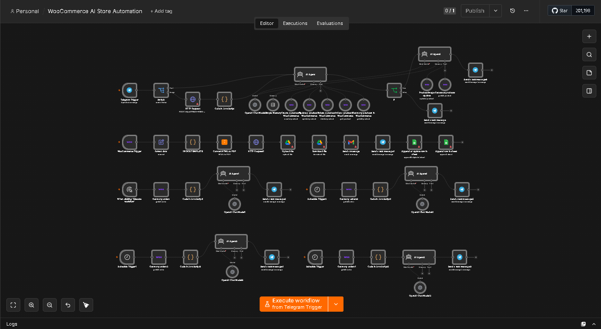
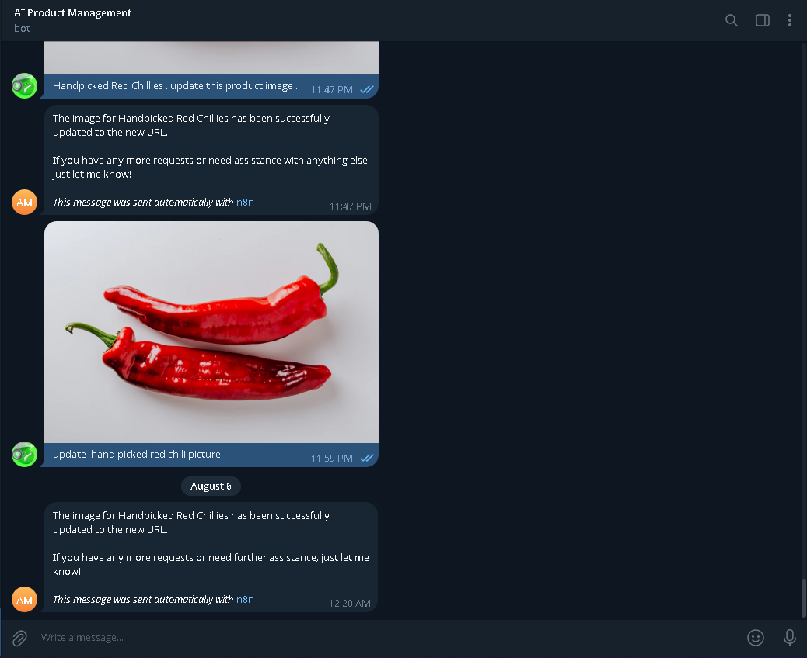

# Screenshots & Visual Documentation

This directory contains visual captures and workflow execution demonstrations for the **WooCommerce AI Store Automation** system.

---

## Included Screenshots

| Filename | Description | Preview |
| :--- | :--- | :--- |
| **`workflow-overview.png`** | Full-canvas view of the 53-node n8n workflow showing all 3 core automation subsystems. | [View Image](workflow-overview.png) |
| **`telegram-image-agent.png`** | Live interaction with the Telegram bot executing automated product photo uploads and catalog image binding. | [View Image](telegram-image-agent.png) |

---

## Visual Overview

### 1. Complete Workflow Canvas (53 Nodes)

### 2. Telegram AI Product Image Ingestion & Update

